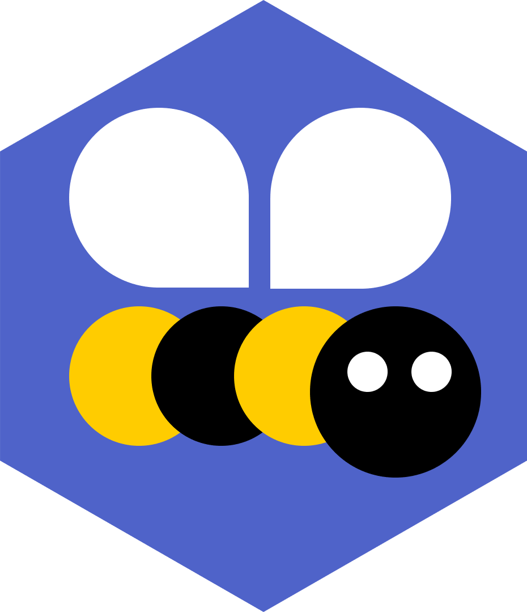

# HiveAlive

||<h2>Open Source monitoring and data analytics for bee keepers and agricultural research</h2>|
|-|-|

## Contents
- **assets**: Images, PPTX and other stuff that isn't code
- **device**: Device client for collecting sensor data and sending to Azure
- **azure/templates**: Templates to deploy HiveAlive to Azure
- **azure/functions**: Azure Functions serverless code for message processing and API
- **site**: Node.js Express web site and portal

